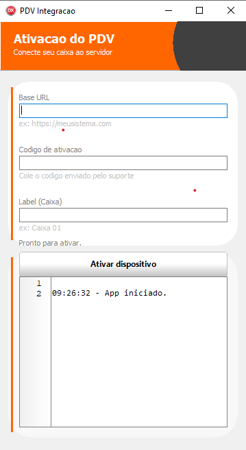

# PDVIntegra

Aplicacao VCL (Delphi 10.1 Berlin) para ativacao de PDV via API. A tela faz a
ativacao do dispositivo e grava `token` e `device_id` em um arquivo INI ao lado
do executavel.

## Requisitos

- Delphi 10.1 Berlin (VCL)
- TMS Component Pack + TMS Component Pack Extra (design-time)

## Estrutura do projeto

- `PDVIntegra.dpr`: entrypoint VCL.
- `uPDVINT.pas` / `uPDVINT.dfm`: UI de ativacao.
- `PDVIntegration.pas`: chamada HTTP e parsing do JSON.
- `PDVStorage.pas`: persistencia do INI (`PDVIntegra.ini`).

## Como executar

1. Abra `PDVIntegra.dproj` no Delphi 10.1.
2. Compile para Win32.
3. Execute o app e preencha:
   - Base URL: ex `https://meusistema.com`
   - Codigo de ativacao: codigo enviado pelo suporte
   - Label (Caixa): ex `Caixa 01`
4. Clique em **Ativar dispositivo** e acompanhe o log.

## Screenshot



## Exemplo de uso (API)

Rota usada pela aplicacao:

- `POST /api/pdv/activate`

JSON enviado:

```json
{
  "code": "SEU_CODIGO",
  "label": "Caixa 01",
  "fingerprint": "md5_do_hardware",
  "hostname": "NOME_DO_PC",
  "os": "Windows ...",
  "appVersion": "1.0.0"
}
```

Campos lidos na resposta:

- Token: `token` ou `accessToken` ou `jwt`
- Device ID: `deviceId` ou `device_id` ou `id`

## Configuracao local

O INI e gravado no mesmo diretorio do executavel:

- `PDVIntegra.ini`

Chaves:

- `[pdv] token=...`
- `[pdv] device_id=...`
